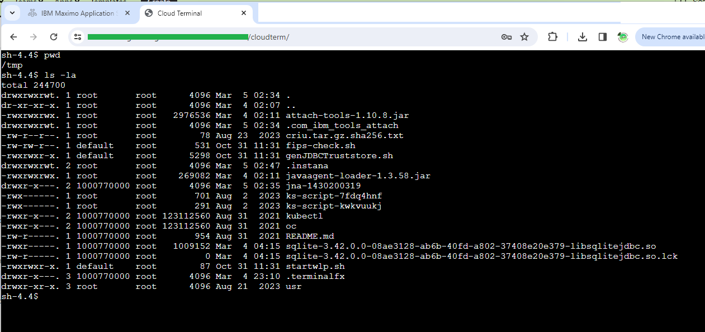

= Cloud Terminal for WebSphere Liberty hot deployment 
Kosta Rebrov copy from (Rahman Usta)
:doctype: article
:encoding: utf-8
:lang: en
:toc: left
:numbered:
:description: CloudTerm is a Web terminal running in the WebSphere as an application. Using Hot deploy method you can put WAR file into a working WebSphere server and get console access without server restart
:author: Kosta Rebrov
:keywords: web,terminal,java,WebSphere Liberty,cloud,tty

== About

CloudTerm is a Spring Boot Java Application Web terminal running in the WebShpere Libery server. You can refer to the original repository for a standalone Java version 
Original repo: "https://github.com/rahmanusta/cloudterm" 

== How to install

* Modify SecurityConfig.java file to cater for your authentication details

[source,java]
----
@Configuration
@EnableWebSecurity
public class SecurityConfig extends WebSecurityConfigurerAdapter {

    @Override
    protected void configure(AuthenticationManagerBuilder auth) throws Exception {
        auth
            .inMemoryAuthentication()
                .withUser("user")
                .password("pass")
                .roles("USER");
    }

    @Bean
    public PasswordEncoder passwordEncoder() {
        // For simplicity, using NoOpPasswordEncoder here.
        // In real-world scenarios, you should use a stronger password encoder.
        return NoOpPasswordEncoder.getInstance();
    }
}
----

Using Maven put the package together

> mvn clean

> mvn package

Build process should pull all required dependency automatically. After successful build you should have WAR file in the target directory.
Place WAR file into dropin directory. In WebSphere Liberty, the dropins directory is monitored for changes by default, so files placed there should be hot deployed automatically. However, if you want to ensure that hot deployment is enabled or force a reload, you can use the following methods:
Enable Automatic Deployment:

By default, WebSphere Liberty automatically deploys applications placed in the dropins directory. Make sure your Liberty server is configured correctly to monitor this directory. You can force a reload by touching the server.xml file or the configDropins/overrides directory where you may have additional configuration files. This action will trigger Liberty to re-read the configuration and redeploy any applications or features.

== License

https://github.com/rahmanusta/cloudterm/blob/master/LICENSE[MIT]
